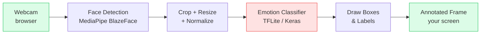

# 🎭 Facial Emotion Recognition

A real-time **facial-emotion recognition** web app built with **Streamlit** and
**WebRTC**. It opens your webcam in the browser, detects every face in each
frame, classifies the expression, and draws the result back onto the live video
— all processed frame-by-frame with **no images stored or uploaded**.

Detected emotions: **Angry**, **Happy**, **Sad**.

---

## ✨ Features

- 📷 **Live webcam** in the browser over WebRTC (works on Streamlit Cloud).
- 🙂 **Multi-face** detection and per-face emotion classification.
- 🏷️ **Annotated video**: colored bounding boxes + label + confidence, with
  auto-positioned text and per-emotion colors.
- 📊 **Live stats**: FPS counter, number of detected faces, and per-face results.
- 🔌 **Model-agnostic** classifier: swap between `.tflite` and `.keras` models by
  changing a single variable — the backend is chosen automatically.
- 🧱 **Clean layering**: UI, orchestration, and inference are fully separated.

---

## 🏗️ Architecture

The pipeline is a pure **frame-in → frame-out** function that knows nothing about
Streamlit. The UI only wires transport (WebRTC) to that function.



**Layers**

| Layer | Module | Responsibility |
|-------|--------|----------------|
| Presentation (UI) | [`app.py`](app.py) | Streamlit page, buttons, live stats — **UI only** |
| Presentation (glue) | [`src/presentation/video_processor.py`](src/presentation/video_processor.py) | WebRTC ↔ pipeline bridge, thread-safe metrics (no Streamlit) |
| Application | [`src/application/webcam_pipeline.py`](src/application/webcam_pipeline.py) | Orchestrates detect → preprocess → classify → draw |
| Infrastructure | [`src/infrastructure/detection/`](src/infrastructure/detection/) | MediaPipe face detection |
| Infrastructure | [`src/infrastructure/preprocessing/`](src/infrastructure/preprocessing/) | Crop / resize / normalize |
| Infrastructure | [`src/infrastructure/inference/`](src/infrastructure/inference/) | TFLite/Keras classifier + `create_classifier` factory |
| Infrastructure | [`src/infrastructure/rendering/`](src/infrastructure/rendering/) | OpenCV box/label drawing |
| Config | [`src/config.py`](src/config.py) | The single model-selection knob |

---

## 🧰 Tech stack

| Tool | Role |
|------|------|
| [Streamlit](https://streamlit.io/) | Web UI & hosting |
| [streamlit-webrtc](https://github.com/whitphx/streamlit-webrtc) | Low-latency webcam streaming in the browser |
| [MediaPipe](https://ai.google.dev/edge/mediapipe) (BlazeFace, Tasks API) | Fast CPU multi-face detection |
| [TensorFlow Lite / LiteRT](https://ai.google.dev/edge/litert) | Emotion classifier inference |
| [OpenCV](https://opencv.org/) (headless) | Crop / resize / annotation |
| [NumPy](https://numpy.org/) | Array plumbing |

---

## 📁 Project structure

```
Face_Expr_Classifier/
├── app.py                              # Streamlit app (UI only) — run this
├── requirements.txt                    # Pinned deps for Streamlit Cloud (CPU)
├── models/
│   └── emotion_model.tflite            # Active classifier (256×256, 3 classes)
├── assets/models/
│   └── blaze_face_short_range.tflite   # MediaPipe face-detector asset
├── src/
│   ├── config.py                       # MODEL_NAME / MODEL_INPUT_SIZE knobs
│   ├── application/
│   │   └── webcam_pipeline.py          # WebcamPipeline (frame in → frame out)
│   ├── presentation/
│   │   └── video_processor.py          # EmotionVideoProcessor (WebRTC glue)
│   └── infrastructure/
│       ├── detection/face_detector.py      # FaceDetector (MediaPipe)
│       ├── preprocessing/preprocessing.py  # FacePreprocessor
│       ├── inference/emotion_classifier.py # create_classifier + backends
│       └── rendering/drawing.py            # EmotionDrawer
└── tools/
    └── demo_detect_webcam.py           # Local OpenCV smoke-test (not deployed)
```

---

## 🚀 Getting started (local)

**Prerequisites:** Python 3.11 recommended, a webcam, and a modern browser.

```bash
# 1. Clone
git clone <your-repo-url>
cd Face_Expr_Classifier

# 2. Create a virtual environment
python -m venv .venv
source .venv/bin/activate        # Windows: .venv\Scripts\activate

# 3. Install dependencies
pip install -r requirements.txt

# 4. Run the app
streamlit run app.py
```

Then open the local URL Streamlit prints, click **▶ Start Camera**, and allow
browser camera access when prompted.

> **Local note (Windows / Python 3.9):** `ai-edge-litert` has no Windows wheel,
> so on Windows the classifier automatically falls back to `tensorflow`'s
> `tf.lite.Interpreter` (the backend is auto-resolved). Streamlit Cloud (Linux)
> uses `ai-edge-litert` as pinned.

---

## ⚙️ Configuration — swapping the model

Everything is driven by one variable in [`src/config.py`](src/config.py):

```python
MODEL_NAME: str = "emotion_model.tflite"   # file inside models/
MODEL_INPUT_SIZE: Tuple[int, int] = (256, 256)
```

Drop a model into `models/` and set `MODEL_NAME`. The **backend is chosen from
the file extension** automatically:

| Extension | Backend | Notes |
|-----------|---------|-------|
| `.tflite`, `.tflite16`, `.tflite32`, `.lite` | TensorFlow Lite / LiteRT | Lightweight, Cloud-ready |
| `.keras`, `.h5`, `.hdf5` | Keras (lazy `tensorflow` import) | Requires `tensorflow` in the environment |

> A `.keras` model needs TensorFlow installed. The pinned `requirements.txt`
> ships only `ai-edge-litert` to keep the Cloud image small, so **TFLite is the
> recommended deployment format**.

### Normalization

The classifier's expected pixel range is model-specific. The current model has
its rescaling **baked in**, so it takes raw `[0, 255]` pixels
(`NormalizationMode.NONE`). If you swap in a model that expects normalized input,
switch to `RESCALE` (or `SYMMETRIC`) in
[`src/presentation/video_processor.py`](src/presentation/video_processor.py).

---

## ☁️ Deploy to Streamlit Community Cloud

1. Push this repo to GitHub (the active model `models/emotion_model.tflite`
   **must** be committed — see [`.gitignore`](.gitignore)).
2. On [share.streamlit.io](https://share.streamlit.io), create a new app pointing
   at your repo and `app.py`.
3. Deploy. `requirements.txt` is picked up automatically.

**Notes**
- The active model is ~72 MB — under GitHub's 100 MB limit, so a normal push
  works. For a slimmer history, consider [Git LFS](https://git-lfs.com/).
- WebRTC needs a STUN server for NAT traversal; a public Google STUN server is
  already configured in `app.py`.

---

## 🔧 How it works

1. **Detect** — MediaPipe BlazeFace (Tasks API) returns bounding boxes.
2. **Preprocess** — each face is cropped, resized to the model input, BGR→RGB
   converted, and normalized.
3. **Classify** — the TFLite/Keras model outputs a probability per emotion;
   `argmax` gives the label.
4. **Draw** — a colored box + `Label 0.97` caption is drawn (auto-positioned so
   it never spills off-frame).
5. **Stream** — the annotated frame is returned to the browser; FPS and results
   are published to the UI without triggering full app reruns.

Performance: components are built once and reused, the classifier is warmed up,
annotation happens in place, and an optional `max_faces` cap bounds cost on
crowded frames.

---

## 📝 License

Add your license of choice (e.g. MIT) as a `LICENSE` file.
